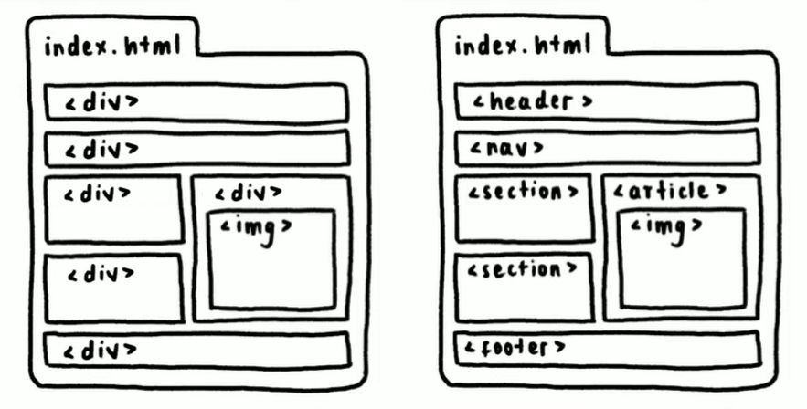

## ¿Cuáles son las etiquetas semánticas?

Las etiquetas semánticas para definir una interfaz de una página web son:

1. **header**: define el encabezado de la página (no confundir con **head**).
2. **nav**: define una barra de navegación que incluye enlaces.
3. **section**: define una sección de la página.
4. **footer**: define un pie de página o de sección.
5. **article**: define un artículo, el cual puede tener su propio encabezado, navegación, sección o pie de página.
   
**NOTA:** Ahora que ya conoces las etiquetas semánticas, evita el uso excesivo de **div**.

## Ventajas de utilizar HTML semántico

Las ventajas de utilizar un HTML semántico son:

1. Ayuda a tu sitio a ser accesible
2. Mejora tu posicionamiento (SEO)
3. Código más claro, legible y mantenible
4. Ayuda a buscadores (como Google) a encontrar tu página.

